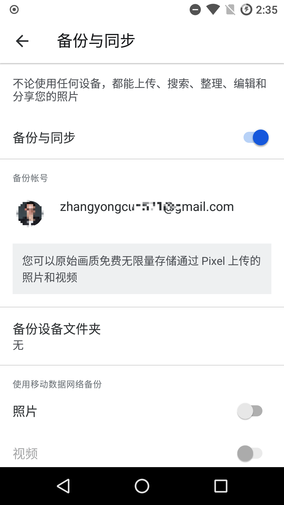

准备：
    - 手机打开开发者模式，并获取 root 权限；
    - 电脑安装 adb 操作环境；
  
1. 下载 nexus.xml 文件，拷贝到 /system/etc/sysconfig 目录；
2. 修改文件权限为 644 (rw-r–r–)；
3. 修改 /system/build.prop 文件 ro.product.model=Pixel 2
4. 重启手机；
5. 打开 Google Photo， 设置-备份与同步，查看是否识别为原是画质无限量

